First create a model page in the replicate:

Visit https://cloud.lambdalabs.com/instances and click on Launch instance

You can select any of the machine you want, prefer the lowest price machine available.

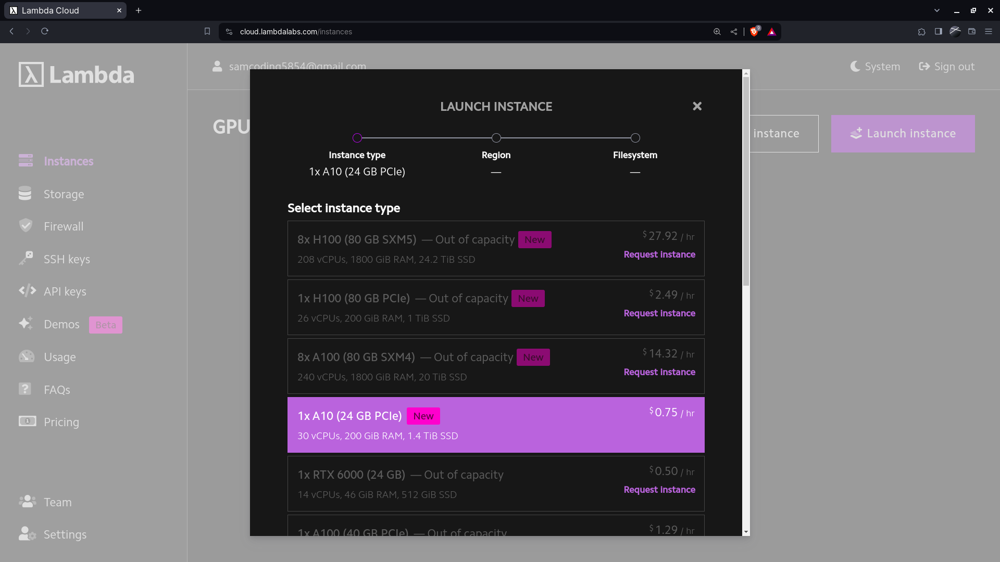

Now select the region, Can select any region

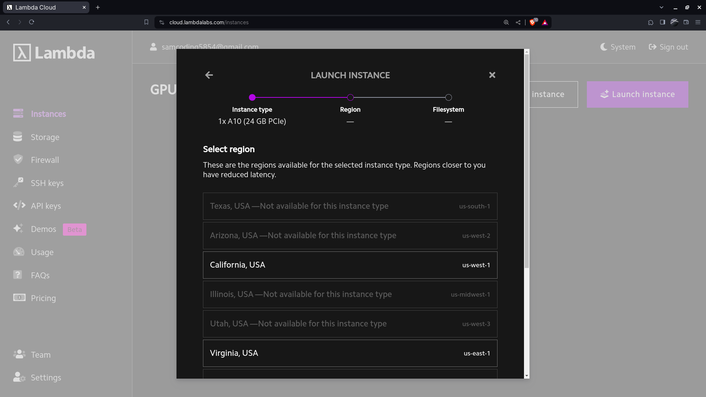

Then select, Don't attach a file system

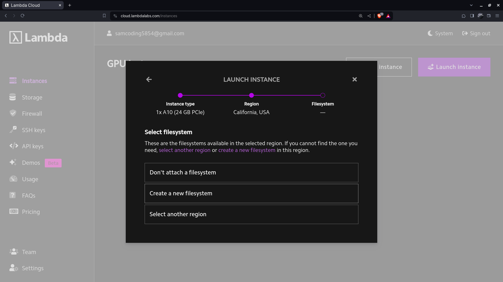

Then launch the instance using the ReplicateHosting SSH(You can create new SSH Key if you want from the left panel, SSH Keys)

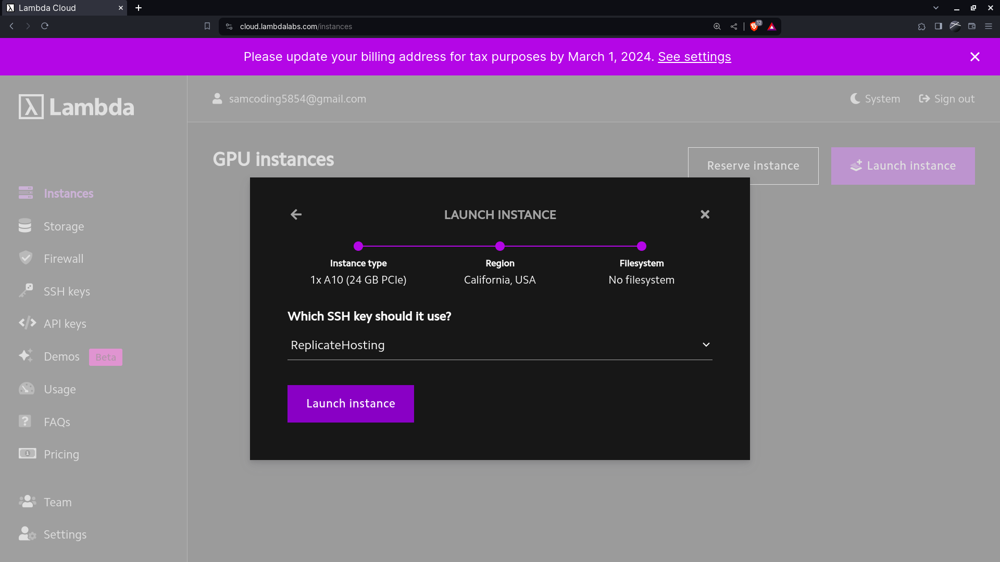

Now wait till the model boots

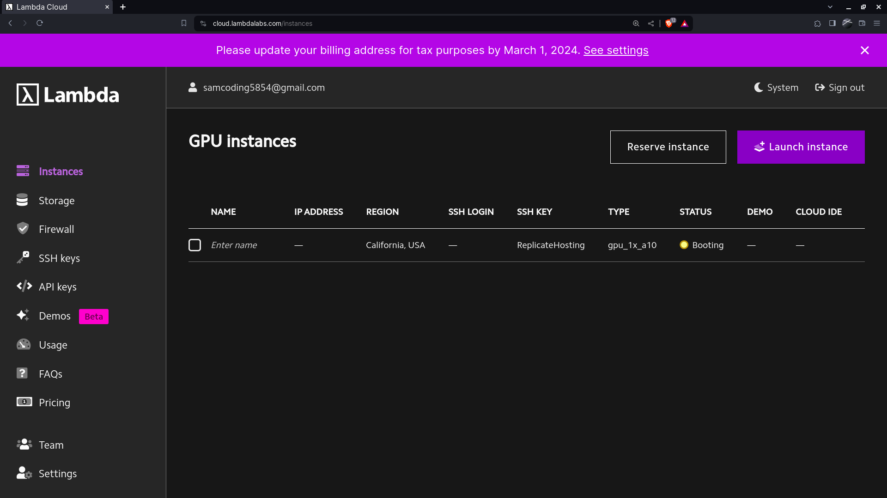

As soon as the model boots, the launch IDE option appears below the cloud IDE option:

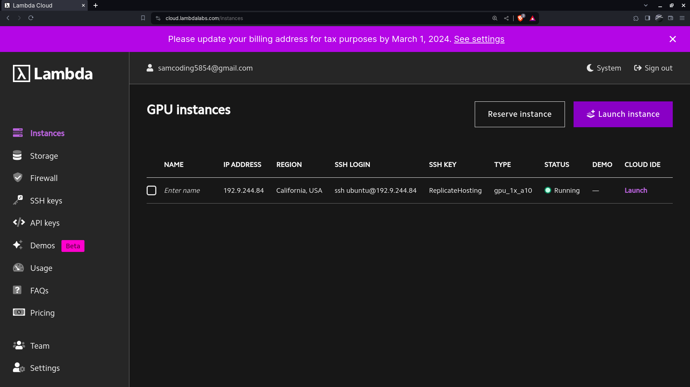

After that an interface appears where you can now push the model. First make a folder by right clicking in the left pane by the name "Model".

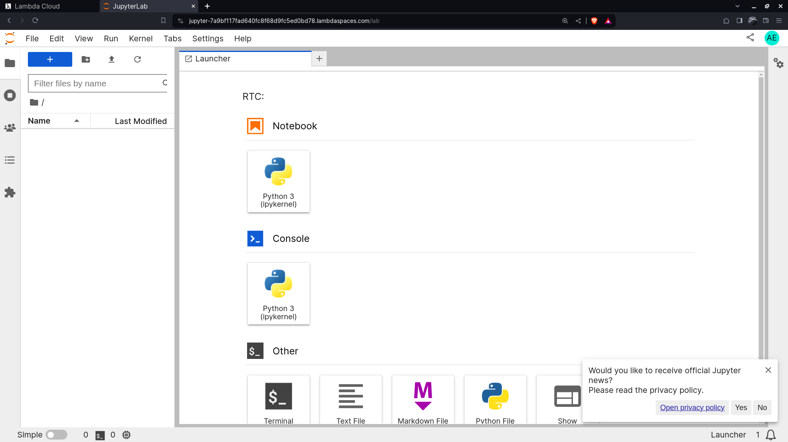

Then open a terminal and run the following code:

```
cd Model

sudo curl -o /usr/local/bin/cog -L https://github.com/replicate/cog/releases/latest/download/cog_`uname -s`_`uname -m`

sudo chmod +x /usr/local/bin/cog

cog init
```

After running this code, This should be the output:

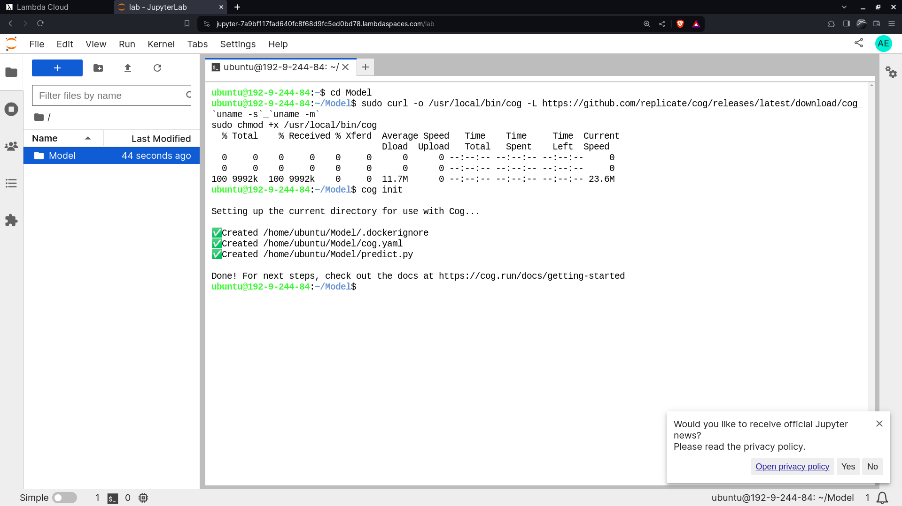

After this click on the folder you made(Model) and there should be two new files named predict.py and cog.yaml. Create a new file named utils.py.
After this copy the code in predict.py, cog.yaml and utils.py in the source code i have provided.

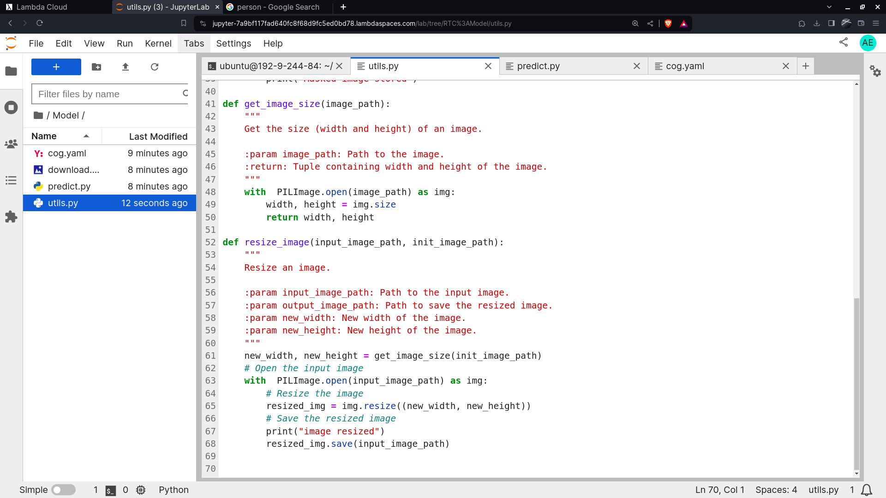

after this you have to run this command to start the downloading of all models and give a sample run. (Before that upload an image in the folder Model, works for jpg, jpeg, png)

```
sudo cog predict -i init_image_path=@<Imagename>.jpeg
```
    
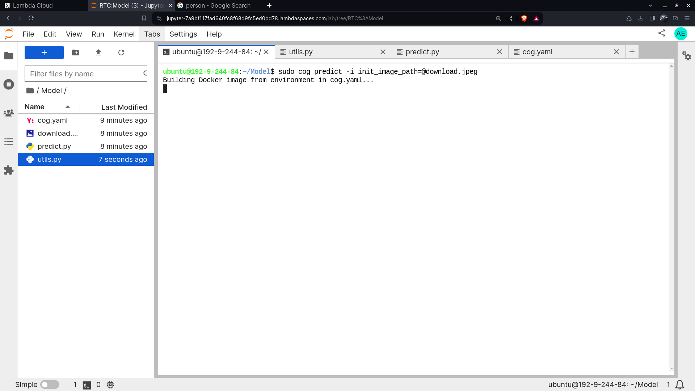

After this wait for a while for successful completion of the application

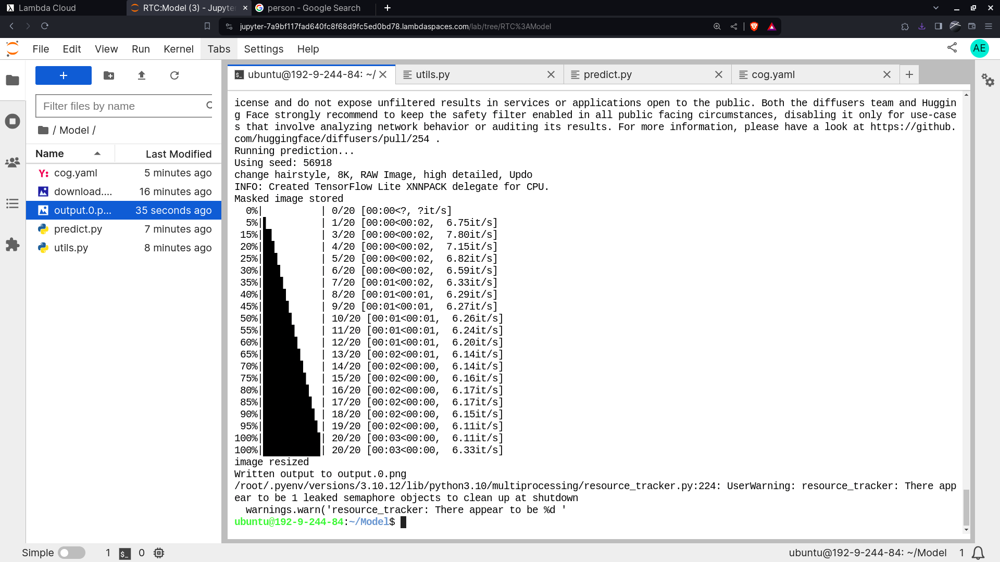

Then login in replicate using this code:

```
sudo cog login
```
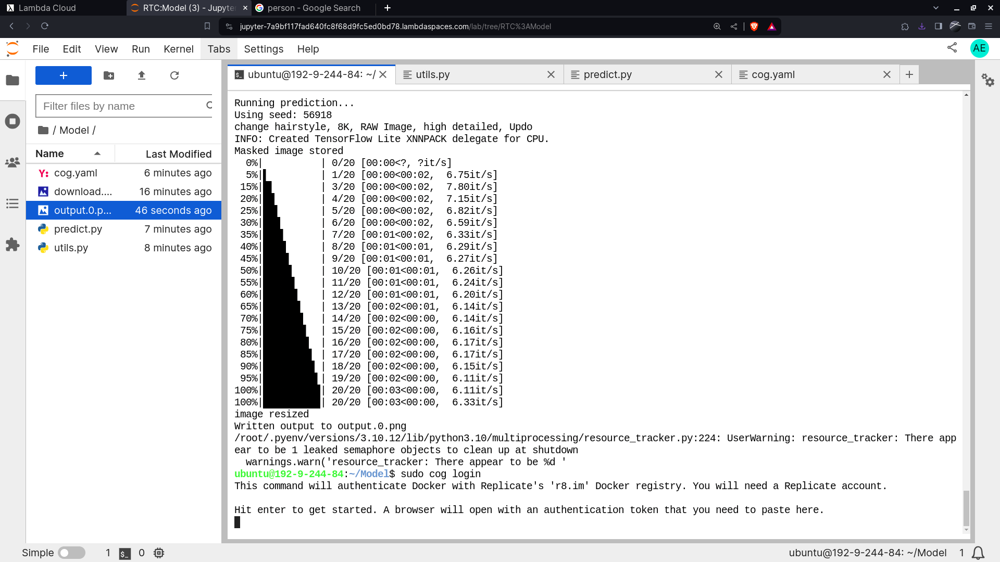

Then press enter and go to the link displayed(https://replicate.com/auth/token) and paste the code in the terminal to authorize login


Then you have to push the model using the code:
```
sudo cog push r8.im/akmmasuduzzaman(<userName>)/<ModelName>
```

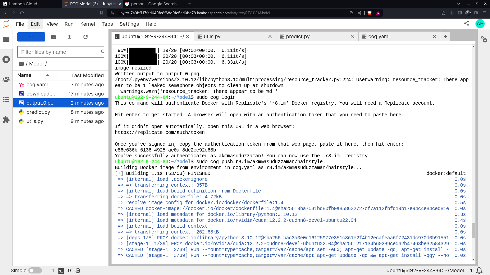

After the successful pushing of the model you will see this message:

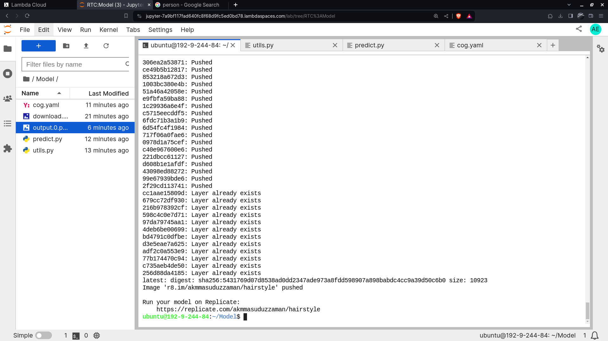

Then you have to close the session by going to the lambda tab.

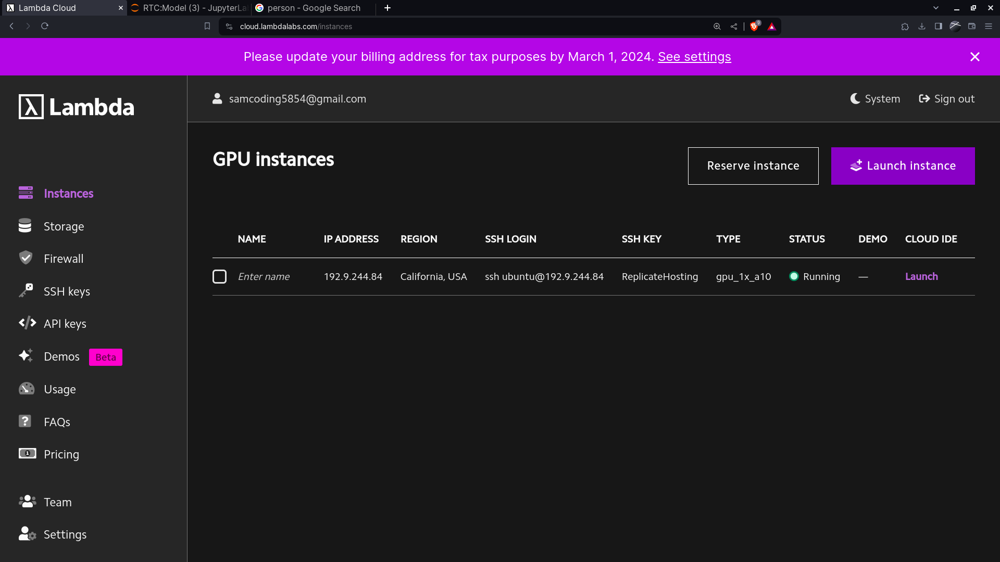

Then select the instance going on and terminate the session by going on the top right area:

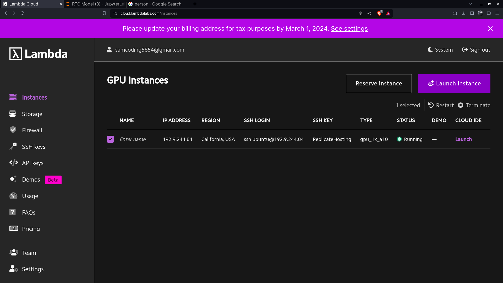

Then type the stuff given to confirm the deletion

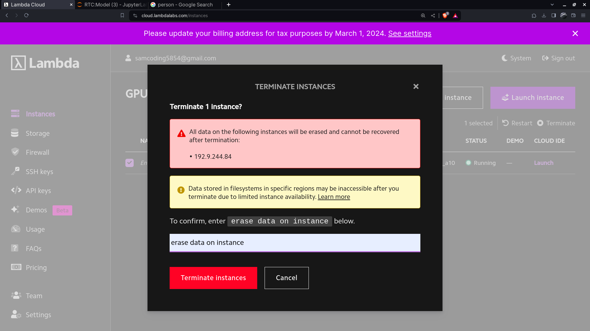


You can now check on the model page 