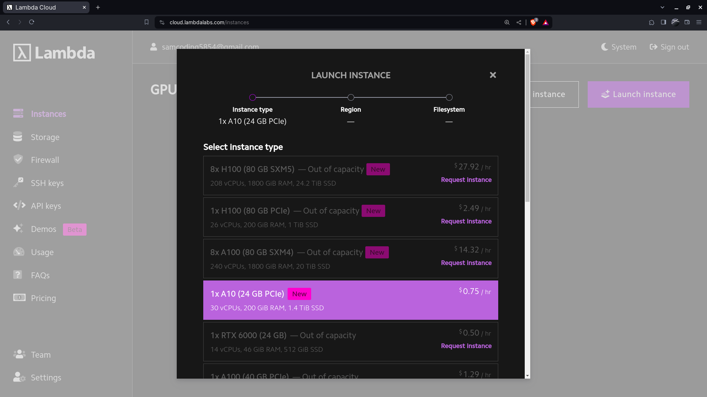
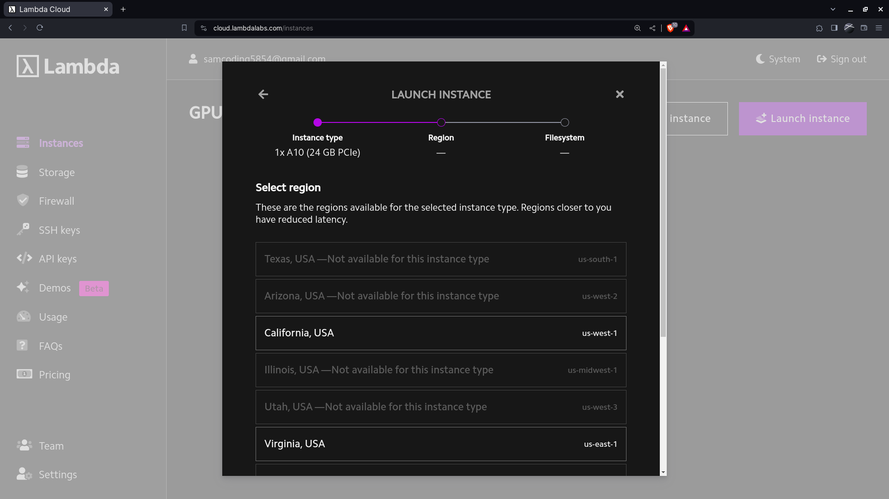
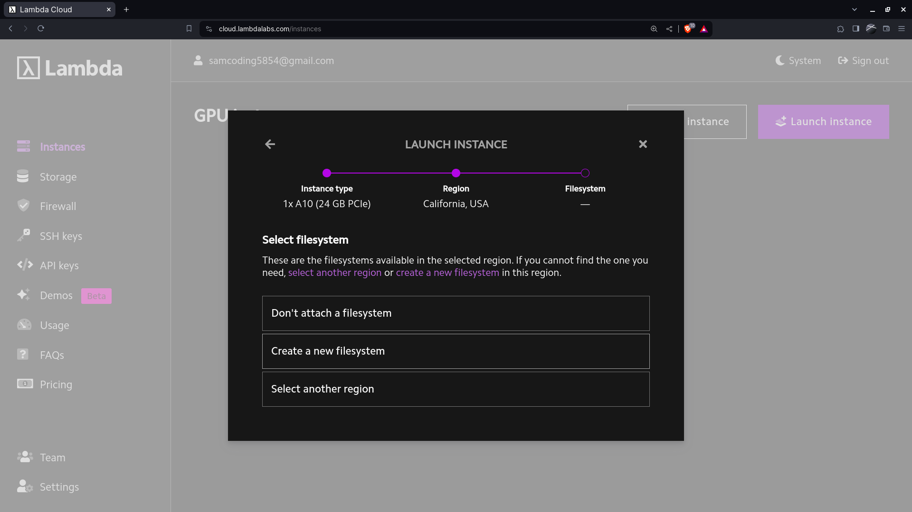
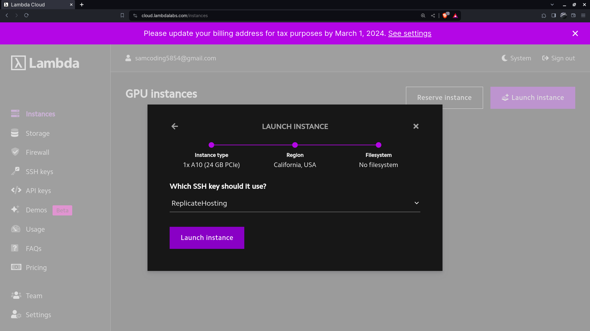
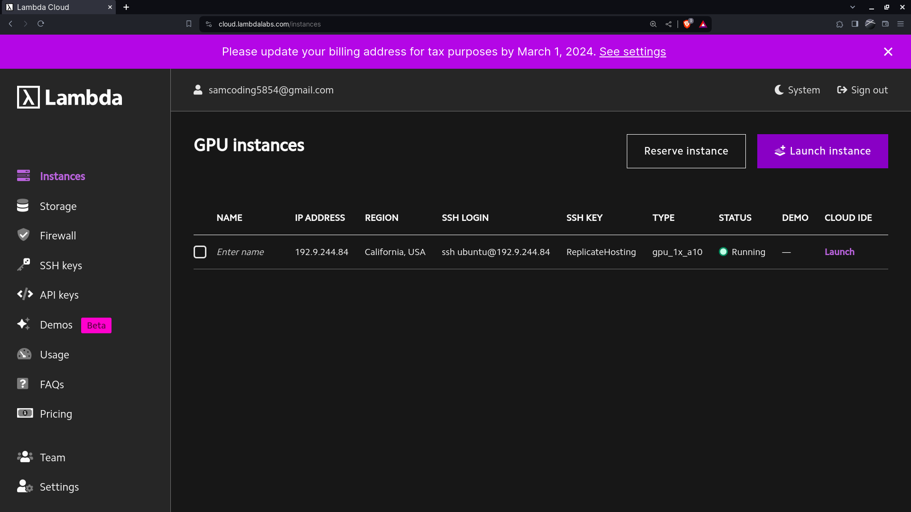

Visit https://cloud.lambdalabs.com/instances and click on Launch instance

You can select any of the machine you want, prefer the lowest price machine available.



Now select the region, Can select any region



Then select, Don't attach a file system



Then launch the instance using the ReplicateHosting SSH(You can create new SSH Key if you want from the left panel, SSH Keys)



Now wait till the model boots


As soon as the model boots, the launch IDE option appears below the cloud IDE option:



After that an interface appears where you can now push the model. First make a folder by right clicking in the left pane by the name "Model".


Then open a terminal and run the following code:

```
cd Model

sudo curl -o /usr/local/bin/cog -L https://github.com/replicate/cog/releases/latest/download/cog_`uname -s`_`uname -m`

sudo chmod +x /usr/local/bin/cog

cog init
```

After running this code, This should be the output:


